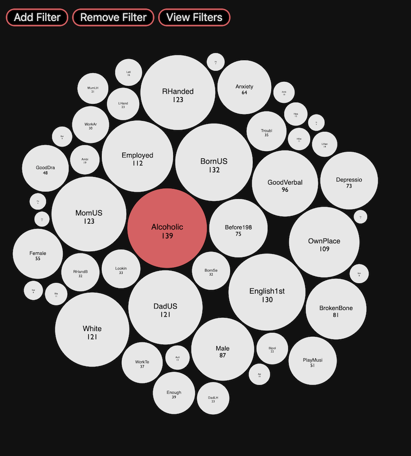

# Intelligent Machinery - Final Project
### Identity Correlation Bubble Map
After spending some time with the handedness data, we found ourselves asking questions about identity and mental illness. We wanted to find out if any obscure or overlooked dimensions of the data correlated strongly with schizophrenia, depression, anxiety, and alcoholism.

We devised this bubble chart tool to visualize these correlations in an attempt to make the data accessible and interactive. We decided to generalize the tool to allow for any subset of legal filters with an AND relationship (for instance, the default shows only answers from surveys were the subject said yes to Anxiety AND Depression).

The selected filters will appear as red bubbles, while the other dimensions of the data are all represented in white. Hover a bubble to see the exact count that it represents.

## How to Run
Create a directory named `data` and drop the raw survey data (in csv format) in that directory. Spin up an http server in the root directory of the project, then navigate to local host on the chosen port to view the bubble chart. I use http-server from npm, but feel free to host it however you like. The specific survey batches that our visualization uses are:
- Batch_2927185_batch_results.csv
- Batch_2930681_batch_results.csv
- Batch_2926198_batch_results.csv

## Improvements and To-do
- We realized that the raw data was not filtered based on the *trap questions* in the survey. We weren't sure what data to ignore and which to keep, so it's likely that some data points are the result of bots rather than humans - we would like to eliminate these data points moving forward for a more accurate representation.

- We would have liked to use a larger subset of the provided survey data, but variance in the length and topic of the surveys made it difficult to scale out bubbles properly. There were also only 3 surveys that asked about Schizophrenia and Depression, which were our main targets for this assignment.

